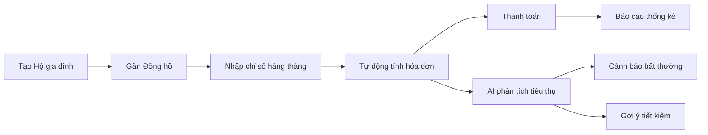
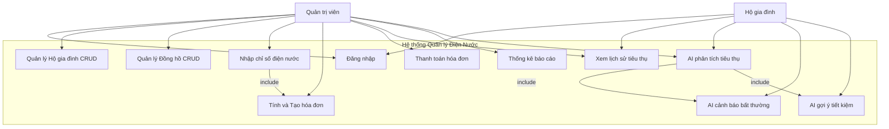
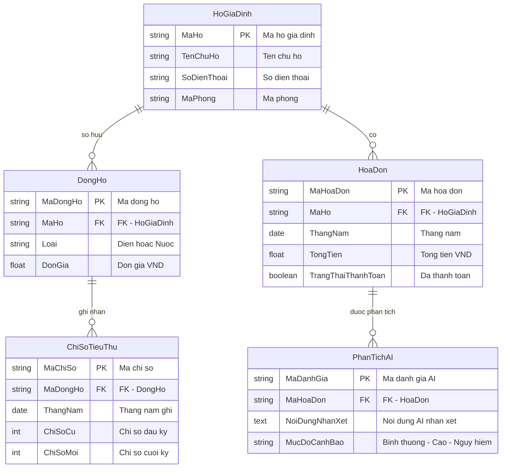
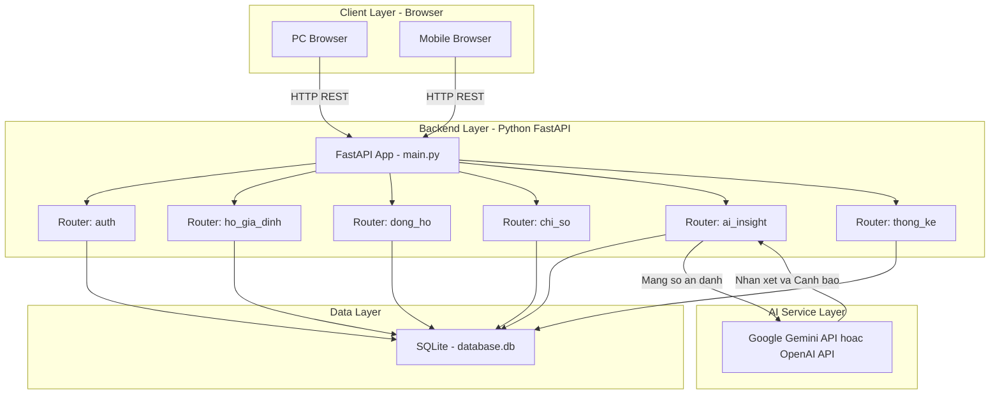
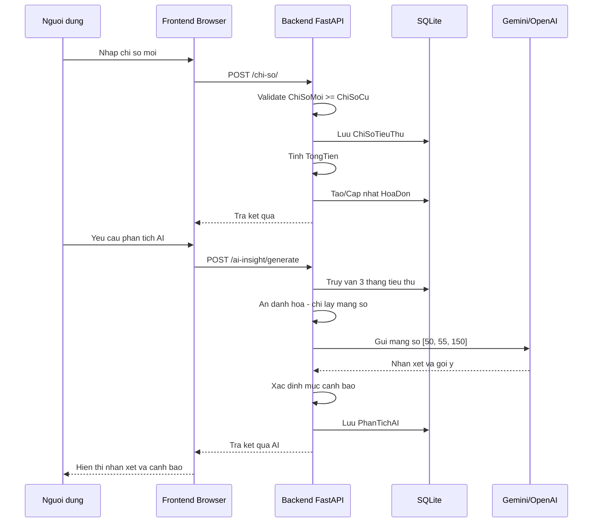

# Bài Kiểm Tra 1: Phân tích yêu cầu, thiết kế hệ thống và xác định vị trí ứng dụng AI

**Đề tài:** Hệ thống quản lý hóa đơn điện nước hộ gia đình có tích hợp AI  
**Sinh viên:** _(điền tên)_  
**Ngày thực hiện:** 25/08/2026

---

## 1. Phân tích bài toán quản lý (Tiêu chí 1 — Mức Biết)

### 1.1. Bối cảnh
Các hộ gia đình, khu nhà trọ hoặc đơn vị quản lý nhỏ hiện đang theo dõi chỉ số điện nước, hóa đơn và thanh toán bằng phương pháp **ghi chép thủ công** (sổ sách, Excel). Điều này dẫn đến:
- Sai sót trong ghi chép chỉ số và tính tiền
- Khó phát hiện tiêu thụ **bất thường** (rò rỉ nước, thiết bị điện hỏng)
- Không có cảnh báo kịp thời khi mức tiêu thụ tăng đột biến
- Mất thời gian tổng hợp báo cáo, theo dõi công nợ

### 1.2. Người dùng (User)
| Actor | Mô tả | Nhu cầu chính |
|-------|-------|---------------|
| **Quản trị viên (Admin)** | Chủ trọ, quản lý khu nhà, hoặc người phụ trách điện nước | Quản lý hộ, nhập chỉ số, tạo hóa đơn, theo dõi thanh toán, xem báo cáo, xem phân tích AI |
| **Hộ gia đình (User)** | Người thuê trọ hoặc thành viên hộ gia đình | Xem hóa đơn, xem lịch sử tiêu thụ, xem gợi ý tiết kiệm từ AI |

### 1.3. Dữ liệu chính
- **Hộ gia đình**: Mã hộ, tên chủ hộ, số điện thoại, mã phòng
- **Đồng hồ đo**: Mã đồng hồ, loại (Điện/Nước), đơn giá, liên kết hộ
- **Chỉ số tiêu thụ**: Chỉ số cũ, chỉ số mới, tháng/năm, liên kết đồng hồ
- **Hóa đơn**: Tổng tiền, trạng thái thanh toán, tháng/năm, liên kết hộ
- **Phân tích AI**: Nhận xét, mức độ cảnh báo, liên kết hóa đơn

### 1.4. Quy trình nghiệp vụ chính



### 1.5. Vấn đề cần giải quyết
1. **Tự động hóa** quy trình ghi chỉ số → tính tiền → thanh toán
2. **Phát hiện bất thường** khi tiêu thụ tăng đột biến nhờ AI
3. **Gợi ý tiết kiệm** điện nước dựa trên dữ liệu thực tế
4. **Quản lý công nợ** rõ ràng, minh bạch

---

## 2. Yêu cầu chức năng (Tiêu chí 2 — Mức Biết)

### 2.1. Chức năng quản lý

| # | Chức năng | Đầu vào | Xử lý | Đầu ra |
|---|-----------|---------|-------|--------|
| 1 | **Đăng nhập và phân quyền** | Tên đăng nhập, mật khẩu | Xác thực, phân biệt admin/user | Token phiên đăng nhập, menu theo quyền |
| 2 | **Quản lý hộ/phòng** (CRUD) | Mã hộ, tên chủ hộ, SĐT, mã phòng | Thêm/sửa/xóa/xem danh sách | Danh sách hộ gia đình |
| 3 | **Quản lý đồng hồ** (CRUD) | Mã đồng hồ, loại, đơn giá, mã hộ | Thêm/sửa/xóa, validate loại (Điện/Nước) | Danh sách đồng hồ theo hộ |
| 4 | **Nhập chỉ số điện nước** | Mã đồng hồ, chỉ số cũ, chỉ số mới, tháng | Validate ChiSoMoi >= ChiSoCu, không âm | Bản ghi chỉ số tiêu thụ |
| 5 | **Tính hóa đơn** | Chỉ số tiêu thụ + đơn giá | TongTien = (ChiSoMoi - ChiSoCu) x DonGia | Hóa đơn tháng (tạo mới hoặc cộng dồn) |
| 6 | **Theo dõi thanh toán** | Mã hóa đơn | Đánh dấu đã thanh toán | Trạng thái thanh toán cập nhật |
| 7 | **Tra cứu lịch sử** | Mã hộ, mã đồng hồ | Truy vấn DB theo bộ lọc | Lịch sử tiêu thụ, hóa đơn |
| 8 | **Thống kê báo cáo** | Khoảng thời gian, bộ lọc | Tổng hợp tiêu thụ, doanh thu, công nợ | Dashboard số liệu, biểu đồ |

### 2.2. Chức năng AI

| # | Chức năng AI | Đầu vào (gửi AI) | Xử lý | Đầu ra |
|---|-------------|-------------------|-------|--------|
| 1 | **Sinh nhận xét tiêu thụ** | Mảng số tiêu thụ 3 tháng (ẩn danh) | Gọi Gemini/OpenAI API phân tích xu hướng | Nhận xét bằng văn bản |
| 2 | **Cảnh báo bất thường** | Mảng số tiêu thụ | So sánh % tăng giữa các tháng | Mức cảnh báo: Bình thường/Cao/Nguy hiểm |
| 3 | **Gợi ý tiết kiệm** | Mảng số + loại (điện/nước) | AI đề xuất biện pháp tiết kiệm phù hợp | Danh sách gợi ý tham khảo |

---

## 3. Yêu cầu phi chức năng (Tiêu chí 3 — Mức Hiểu)

| Yêu cầu | Mô tả | Biện pháp |
|----------|-------|-----------|
| **Bảo mật** | Bảo vệ API key, không lộ thông tin nhạy cảm | API key lưu trong `.env`, không commit lên Git |
| **Ẩn danh hóa** | Không gửi thông tin cá nhân lên AI API | Chỉ gửi mảng số liệu tiêu thụ, không gửi tên/SĐT/mã phòng |
| **Phân quyền** | Phân biệt quyền admin và user | Admin: CRUD + thống kê; User: xem hóa đơn + AI |
| **Hiệu năng** | Phản hồi nhanh, xử lý được dữ liệu demo | SQLite cho demo, index trên khóa chính |
| **Khả dụng** | Hệ thống chạy ổn định | Xử lý exception, rollback khi lỗi DB |
| **Trải nghiệm người dùng** | Giao diện thân thiện, dễ sử dụng | Responsive design, thông báo lỗi rõ ràng |
| **Sao lưu** | Có khả năng backup dữ liệu | SQLite file-based, dễ copy backup |

---

## 4. Thiết kế Actor và Use Case (Tiêu chí 4 — Mức Hiểu)

### 4.1. Sơ đồ Use Case



### 4.2. Mô tả Use Case chính

| Use Case | Actor | Mô tả | Điều kiện tiên quyết |
|----------|-------|-------|---------------------|
| UC1: Đăng nhập | Admin, User | Nhập tài khoản/mật khẩu để truy cập hệ thống | Tài khoản đã được tạo |
| UC2: Quản lý hộ | Admin | Thêm/sửa/xóa/xem hộ gia đình | Đã đăng nhập với quyền admin |
| UC3: Quản lý đồng hồ | Admin | Thêm/sửa/xóa đồng hồ, gắn với hộ | Hộ gia đình đã tồn tại |
| UC4: Nhập chỉ số | Admin | Nhập chỉ số mới cho đồng hồ theo tháng | Đồng hồ đã được tạo |
| UC5: Tính hóa đơn | Hệ thống | Tự động tính tiền khi nhập chỉ số | Chỉ số hợp lệ |
| UC6: Thanh toán | Admin | Đánh dấu hóa đơn đã thanh toán | Hóa đơn đã tồn tại |
| UC7: Xem lịch sử | Admin, User | Tra cứu lịch sử tiêu thụ theo hộ/đồng hồ | Đã đăng nhập |
| UC8: Thống kê | Admin | Xem dashboard tiêu thụ, doanh thu, công nợ | Đã đăng nhập admin |
| UC9: AI phân tích | Admin, User | Gọi AI phân tích lịch sử tiêu thụ 3 tháng | Có dữ liệu >= 1 tháng |

---

## 5. Thiết kế Cơ sở dữ liệu (Tiêu chí 5 — Mức Hiểu)

### 5.1. Sơ đồ ERD



### 5.2. Bảng thiết kế chi tiết

| Bảng | Khóa chính | Khóa ngoại | Ràng buộc |
|------|-----------|------------|-----------|
| `HoGiaDinh` | MaHo (String) | — | TenChuHo, SoDienThoai, MaPhong: NOT NULL |
| `DongHo` | MaDongHo (String) | MaHo -> HoGiaDinh | Loai thuoc {Dien, Nuoc}, DonGia > 0 |
| `ChiSoTieuThu` | MaChiSo (String) | MaDongHo -> DongHo | ChiSoMoi >= ChiSoCu >= 0 |
| `HoaDon` | MaHoaDon (String) | MaHo -> HoGiaDinh | TongTien >= 0, Default TrangThai = False |
| `PhanTichAI` | MaDanhGia (String) | MaHoaDon -> HoaDon | NoiDungNhanXet: NOT NULL |

### 5.3. Giải thích quan hệ
- **HoGiaDinh -> DongHo** (1:N): Mỗi hộ có thể có nhiều đồng hồ (1 điện + 1 nước)
- **DongHo -> ChiSoTieuThu** (1:N): Mỗi đồng hồ ghi nhiều chỉ số theo tháng
- **HoGiaDinh -> HoaDon** (1:N): Mỗi hộ có nhiều hóa đơn (mỗi tháng 1 hóa đơn)
- **HoaDon -> PhanTichAI** (1:N): Mỗi hóa đơn có thể được AI phân tích nhiều lần

---

## 6. Thiết kế kiến trúc hệ thống (Tiêu chí 6 — Mức Hiểu)

### 6.1. Sơ đồ kiến trúc



### 6.2. Luồng dữ liệu chính



### 6.3. Tech Stack

| Layer | Công nghệ | Lý do chọn |
|-------|-----------|------------|
| Frontend | HTML + CSS + JavaScript thuần | Đơn giản, không cần build tool, dễ demo |
| Backend | Python FastAPI | Async, auto-docs (Swagger), phổ biến |
| ORM | SQLAlchemy 2.0 | Hỗ trợ tốt SQLite, type-safe |
| Database | SQLite | File-based, không cần cài server DB |
| AI Engine | Google Gemini API | Miễn phí, hỗ trợ tiếng Việt tốt |
| Validation | Pydantic v2 | Tích hợp sẵn FastAPI, validate tự động |

---

## 7. Xác định vị trí ứng dụng AI (Tiêu chí 7 — Mức Vận dụng)

### 7.1. Chức năng AI được tích hợp

| # | Chức năng AI | Gắn với dữ liệu nào | Nhu cầu thực tế |
|---|-------------|---------------------|-----------------|
| 1 | **Sinh nhận xét tiêu thụ theo tháng** | Bảng ChiSoTieuThu — 3 tháng gần nhất | Người dùng muốn biết xu hướng tiêu thụ tăng/giảm |
| 2 | **Cảnh báo dấu hiệu bất thường** | So sánh % biến động giữa các tháng | Phát hiện sớm rò rỉ nước, thiết bị điện hỏng |
| 3 | **Gợi ý tiết kiệm tham khảo** | Mảng số tiêu thụ + loại (điện/nước) | Giúp hộ gia đình giảm chi phí |

### 7.2. Tại sao AI phù hợp ở đây?
- Dữ liệu tiêu thụ là **số liệu có cấu trúc rõ**, AI dễ phân tích
- Người dùng cần **nhận xét bằng ngôn ngữ tự nhiên**, không chỉ là con số
- Phát hiện **bất thường** (tăng > 50%) cần cả logic tính toán lẫn diễn giải
- Gợi ý tiết kiệm cần **kiến thức domain** mà AI generative có sẵn

### 7.3. AI KHÔNG làm gì
- Không thay thế logic tính hóa đơn (dùng công thức cố định)
- Không truy cập dữ liệu cá nhân (ẩn danh hóa trước khi gửi)
- Không tự động quyết định (chỉ đưa gợi ý tham khảo)

---

## 8. Thiết kế Prompt và Luồng gọi AI (Tiêu chí 8 — Mức Vận dụng)

### 8.1. System Prompt

```
Bạn là trợ lý phân tích hóa đơn điện nước. 
Chỉ nhận xét từ dữ liệu được cung cấp, không tự tạo số liệu.
```

**Ràng buộc:**
- Không cho phép AI bịa số liệu
- AI chỉ phân tích dữ liệu được cung cấp
- Phản hồi bằng tiếng Việt

### 8.2. User Prompt mẫu

```
Lịch sử tiêu thụ 3 tháng qua: {mang_lich_su_dien_nuoc}. 
Hãy tóm tắt biến động và chỉ ra tháng cần kiểm tra rò rỉ nếu có, gợi ý cách tiết kiệm.
```

**Input format:** Mảng số nguyên, ví dụ: `[50, 55, 150]`  
**Output format:** Văn bản tiếng Việt, bao gồm:
1. Tóm tắt xu hướng tiêu thụ
2. Chỉ ra tháng bất thường (nếu có)
3. Gợi ý tiết kiệm

### 8.3. Ràng buộc ẩn danh hóa

| Thông tin | Gửi lên AI? | Lý do |
|-----------|-------------|-------|
| Mảng số tiêu thụ [50, 55, 150] | CÓ | Dữ liệu cần phân tích |
| Loại đồng hồ (Điện/Nước) | CÓ | Giúp AI gợi ý phù hợp |
| Tên chủ hộ | KHÔNG | Thông tin cá nhân |
| Số điện thoại | KHÔNG | Thông tin cá nhân |
| Mã phòng | KHÔNG | Thông tin nhận dạng |
| Mã hộ | KHÔNG | Thông tin nhận dạng |

### 8.4. Luồng gọi AI

```
1. Frontend gọi POST /ai-insight/generate {ma_hoa_don, ma_ho}
2. Backend truy vấn DB -> lấy 3 tháng ChiSoTieuThu
3. Tính mảng tiêu thụ: [ChiSoMoi - ChiSoCu] cho mỗi tháng
4. Ẩn danh: CHỈ gửi mảng số [50, 55, 150] lên AI
5. Gọi Gemini/OpenAI API với system prompt + user prompt
6. Nhận kết quả text -> xác định mức cảnh báo (Bình thường/Cao/Nguy hiểm)
7. Lưu vào bảng PhanTichAI
8. Trả kết quả cho Frontend hiển thị
```

### 8.5. Xử lý lỗi AI
- Không có API key -> trả mock response (phân tích mẫu)
- API timeout -> trả thông báo lỗi, không crash
- Response rỗng -> trả "Chưa đủ dữ liệu để phân tích"

---

## 9. Minh chứng sử dụng AI trong phân tích và thiết kế (Tiêu chí 9 — Mức Vận dụng)

### 9.1. Prompt đã sử dụng để phân tích yêu cầu

**Kỹ thuật: Cấu trúc prompt hiệu quả** (áp dụng từ `prompts/01-Cau-truc-prompt-hieu-qua/`)

```
[Instructions]
Phân tích yêu cầu cho hệ thống quản lý hóa đơn điện nước hộ gia đình có tích hợp AI.
Xác định vấn đề nghiệp vụ, mục tiêu, actor, chức năng chính, dữ liệu chính, 
yêu cầu phi chức năng.

[Context]
- Hệ thống dùng cho khu trọ, hộ gia đình nhỏ.
- Cần quản lý hộ/phòng, đồng hồ điện nước, chỉ số, hóa đơn, thanh toán.
- Tích hợp AI: nhận xét tiêu thụ, cảnh báo bất thường, gợi ý tiết kiệm.
- Tech: FastAPI + SQLite + Gemini/OpenAI.

[Constraints]
- Chỉ 5 bảng CSDL: HoGiaDinh, DongHo, ChiSoTieuThu, HoaDon, PhanTichAI.
- AI phải ẩn danh hóa: chỉ gửi mảng số, không gửi thông tin cá nhân.
- Đề tài mức cơ bản.

[Output Format]
Markdown: bối cảnh, actor, chức năng, dữ liệu, yêu cầu phi chức năng.
```

### 9.2. Prompt đã sử dụng để thiết kế CSDL

**Kỹ thuật: Chain-of-Thought** (áp dụng từ `prompts/04-Chain-of-Thought/`)

```
Thiết kế CSDL cho hệ thống quản lý hóa đơn điện nước.
Hãy suy nghĩ từng bước:
1. Xác định entity chính (hộ, đồng hồ, chỉ số, hóa đơn, AI).
2. Xác định thuộc tính và kiểu dữ liệu.
3. Xác định khóa chính, khóa ngoại.
4. Xác định quan hệ 1-N.
5. Ràng buộc: ChiSoMoi >= ChiSoCu, DonGia > 0.
6. Vẽ ERD bằng Mermaid.
```

### 9.3. Prompt xác định actor

**Kỹ thuật: Zero-Shot** (áp dụng từ `prompts/02-Zero-Shot-Prompting/`)

```
Xác định actor và chức năng cho hệ thống quản lý điện nước.
- Hệ thống có 2 loại người dùng: quản trị viên và hộ gia đình.
- Quản trị viên: CRUD, nhập chỉ số, tạo hóa đơn, thống kê.
- Hộ gia đình: xem hóa đơn, lịch sử, phân tích AI.
Liệt kê actor -> chức năng -> quyền truy cập.
```

### 9.4. Nhận xét và kiểm chứng kết quả AI

| Phần | AI tạo ra | Sinh viên kiểm chứng/chỉnh sửa |
|------|-----------|-------------------------------|
| Danh sách chức năng | AI liệt kê 12 chức năng | Giữ lại 8 chức năng quản lý + 3 AI theo đề bài, bỏ các chức năng dư |
| ERD | AI đề xuất 7 bảng | Giữ đúng 5 bảng theo ràng buộc đề bài |
| System Prompt | AI gợi ý prompt dài | Rút gọn theo đúng mẫu trong đề tài |
| Kiến trúc | AI đề xuất microservices | Chỉnh lại thành monolith đơn giản phù hợp mức cơ bản |

---

## 10. Kế hoạch triển khai các giai đoạn tiếp theo (Tiêu chí 10 — Mức Vận dụng)

### KT2: Xây dựng chức năng quản lý
- Hoàn thiện CRUD: hộ gia đình, đồng hồ, chỉ số, hóa đơn
- Xây dựng giao diện Frontend (HTML/CSS/JS)
- Đăng nhập, phân quyền cơ bản
- Tìm kiếm, lọc, dashboard thống kê
- Kết nối DB ổn định, xử lý lỗi
- README + hướng dẫn cài đặt

### KT3: Tích hợp AI + Kiểm thử
- Tích hợp Gemini/OpenAI API vào hệ thống
- Tối ưu prompt qua 3 vòng thử nghiệm
- Test case: nhập chỉ số đúng/sai/biên
- Test AI: dữ liệu âm, dữ liệu rỗng, timeout
- Review code bằng AI

### Cuối kỳ: Hoàn thiện
- Polish giao diện, fix bug
- Báo cáo kỹ thuật
- Dữ liệu mẫu demo
- Chuẩn bị slide thuyết trình

---

## Phụ lục: Tham chiếu Prompt Templates đã áp dụng

| Prompt mẫu gốc (đề tài bán hàng) | Đã chuyển thể sang đề tài điện nước |
|----------------------------------|--------------------------------------|
| `01-Cau-truc-Phan-tich-yeu-cau.md` | Phân tích yêu cầu hệ thống điện nước (Mục 9.1) |
| `02-Zero-Shot-Xac-dinh-actor.md` | Xác định actor Admin + Hộ gia đình (Mục 9.3) |
| `04-CoT-Thiet-ke-CSDL.md` | Thiết kế 5 bảng CSDL (Mục 9.2) |
| `08-Sinh-ma-API-CRUD.md` | Sẽ áp dụng ở KT2 khi sinh code |
